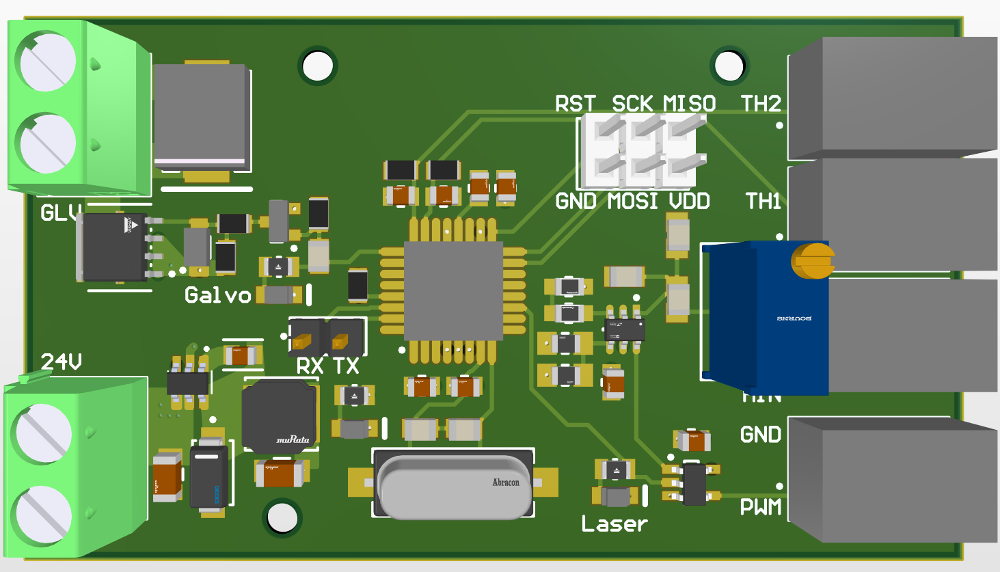

# Altium_projector_driver
Altium project files for a projector driver. 4-layer.
- Connects to
   - Laser (jst-xh): Laser Tree [K60](https://lasertree.com/products/lasertree-k60-60w-40w-20w-power-switchable-laser-module). 24V 60W optical power 4kHz pwm.
   - Galvo (screw): 24V 2A
   - Laser DAC (jst-xh): [Helios DAC](https://bitlasers.com/helios-laser-dac/). 1.68V (3.3V half side) ILDA.
   - 10k thermistors (jst-xh).
   - 24V dc power supply (screw)
- Features
  - Thermal shutoff based on the temperatures of the laser module and galvo driver PCB.
  - P-channel MOSFET switch for Galvo.
  - 1.68V analog to 4kHz 5V pwm conversion + AND gate switch for Laser.
  - LED indicators for the board power, Galvo enable, and Laser enable.
  - ATmega328P.
  - 6-pin ICSP + TTL interface.

